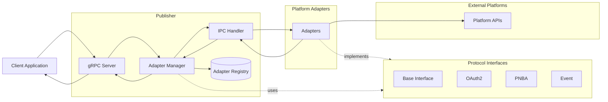
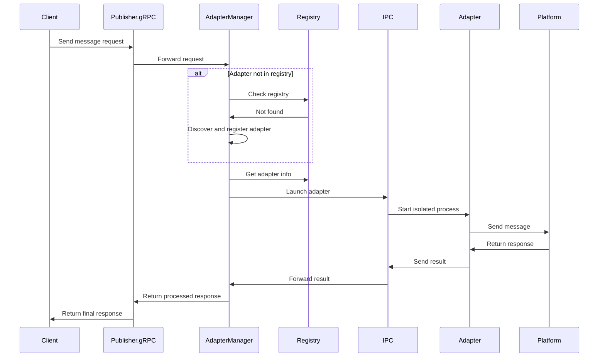

# Adapter Architecture – Data Flow

This document describes the architecture and data flow between Publisher and Platform Adapters in RelaySMS-Publisher.

---

## 1. System Architecture

### Overview

High-level architecture:

---

## 2. Data Flow

Data flow through the system:

---

## 3. Protocol Interfaces

Protocol Interfaces define contracts for platform interactions. Adapters implement these interfaces to enable communication with various platforms through a consistent approach.

Interface types:

- **Base Interface**: Core methods for configuration and manifest retrieval.
- **OAuth2**: Authorization flow and token management for OAuth2 platforms.
- **PNBA** (Phone Number Based Authentication): Code validation and messaging for PNBA platforms.
- **Event**: CRUD operations for event-driven platforms.

---

## 4. Components

### Publisher

- **gRPC Server**: Entry point for client requests.
- **Adapter Manager**: Manages adapter selection, discovery, and lifecycle.
- **IPC Handler**: Handles inter-process communication using JSON over pipes.
- **Adapter Registry**: Stores adapter metadata.

### Platform Adapters

- **Adapters**: Modular components implementing protocol interfaces for specific platforms (Gmail, Twitter, Telegram, etc.).

---

## 5. Data Flow Summary

1. Client sends message request to gRPC server.
2. Request is forwarded to Adapter Manager.
3. Adapter Manager checks registry for appropriate adapter.
4. If needed, adapter is discovered and registered.
5. IPC Handler launches adapter in isolated environment.
6. Adapter communicates with external platform.
7. Response flows back through system to client.
