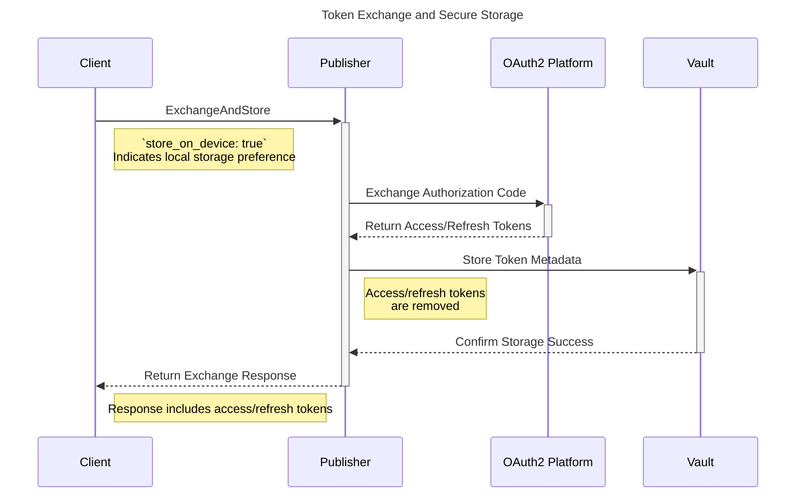
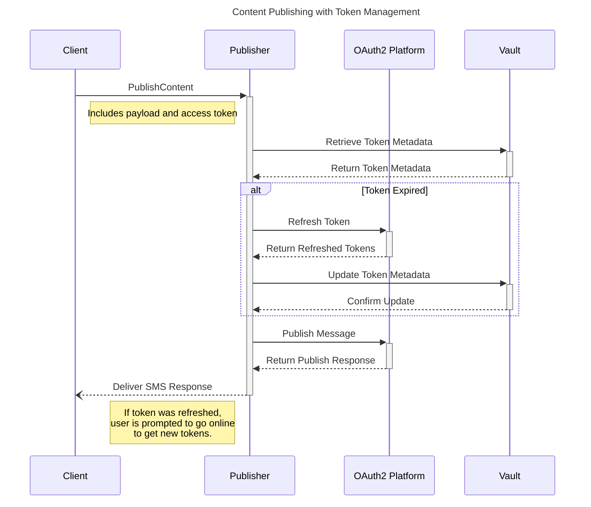

# Storing and Using Tokens Locally - Data Flow Diagrams (DFD)

This document outlines the data flow for securely storing and using access/refresh tokens locally.

## 1. Storing Access/Refresh Tokens

The following sequence diagram illustrates the process of exchanging and securely storing access/refresh tokens:

### Summary:

1. **Client Request**: The client requests token exchange and storage.
2. **Token Exchange**: The Publisher exchanges the authorization code with the OAuth2 platform for tokens.
3. **Secure Storage**: Tokens metadata are stored in the Vault, and the access/refresh tokens are sent to the client.
4. **Response**: The Publisher confirms the operation to the client.

## 2. Publishing Content with Local Tokens

This sequence diagram details the process of publishing content using locally stored tokens, including token refresh handling:

### Summary:

1. **Client Request**: The client sends a request to publish content, including the payload and access token.
2. **Token Retrieval**: The Publisher retrieves token metadata from the Vault.
3. **Token Refresh (if needed)**: If the token is expired, the Publisher refreshes it with the OAuth2 platform and updates the Vault.
4. **Content Publishing**: The Publisher uses the valid token to publish the message.
5. **Response**: The Publisher delivers the SMS response to the client. If token was refreshed, the user is prompted to go online and get new tokens.
